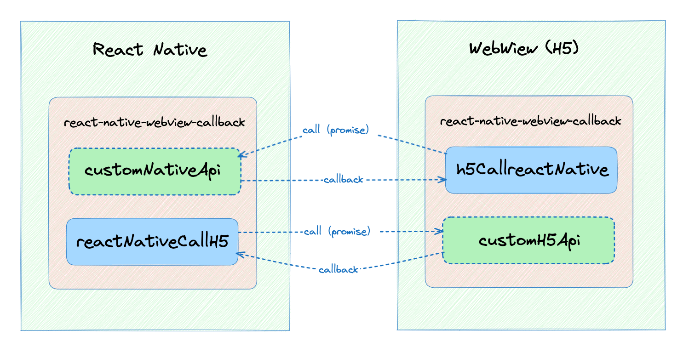

# react-native-webview-callback-demo

This project demonstrates how to configure and use react-native-webview-callback

我的博文：[实现React Native与内嵌H5相互通信](https://juejin.cn/post/7297144566251454502)

## AwesomeProject（React Native 工程）

This directory is the React Native project

## h5-project（内嵌H5工程）

This directory is the H5 project

## note

Domo for v0.0.2 && v0.0.3